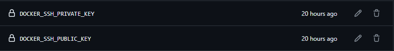
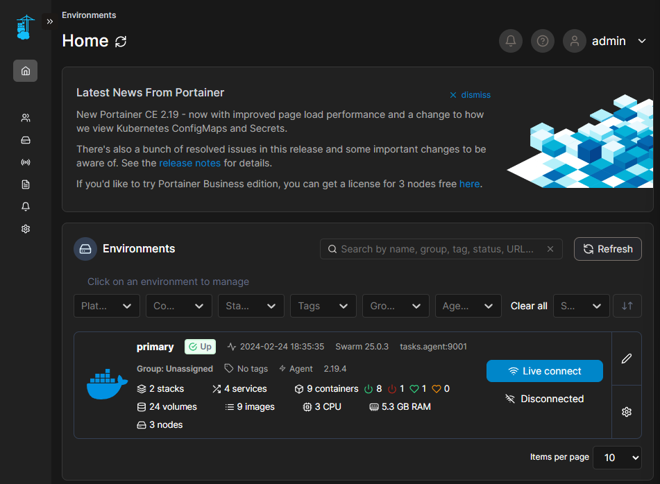
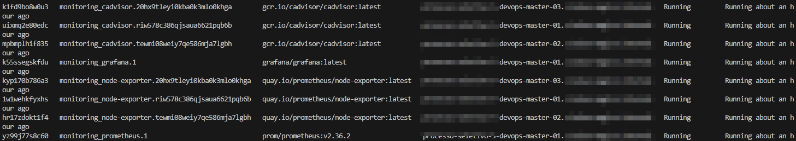
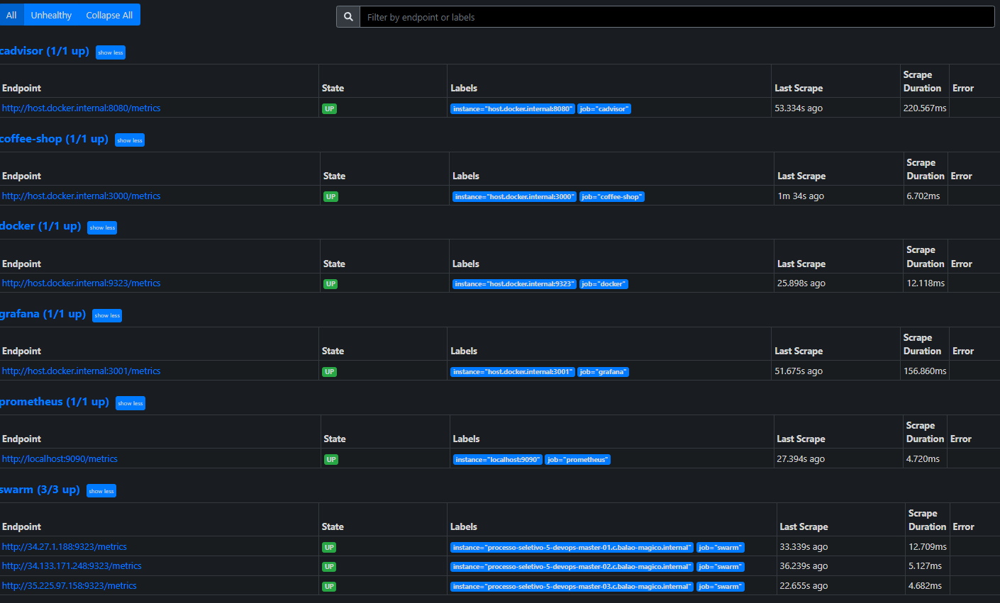
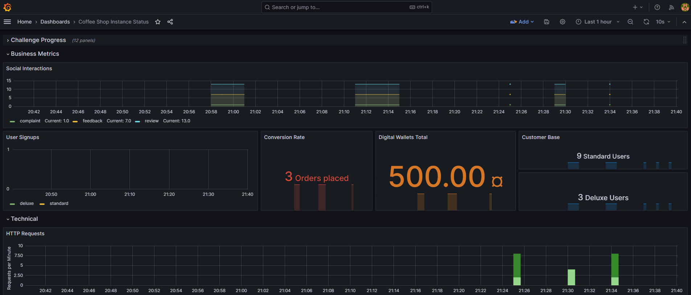
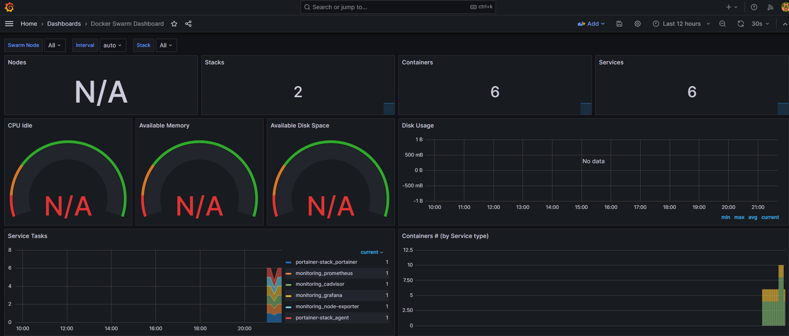
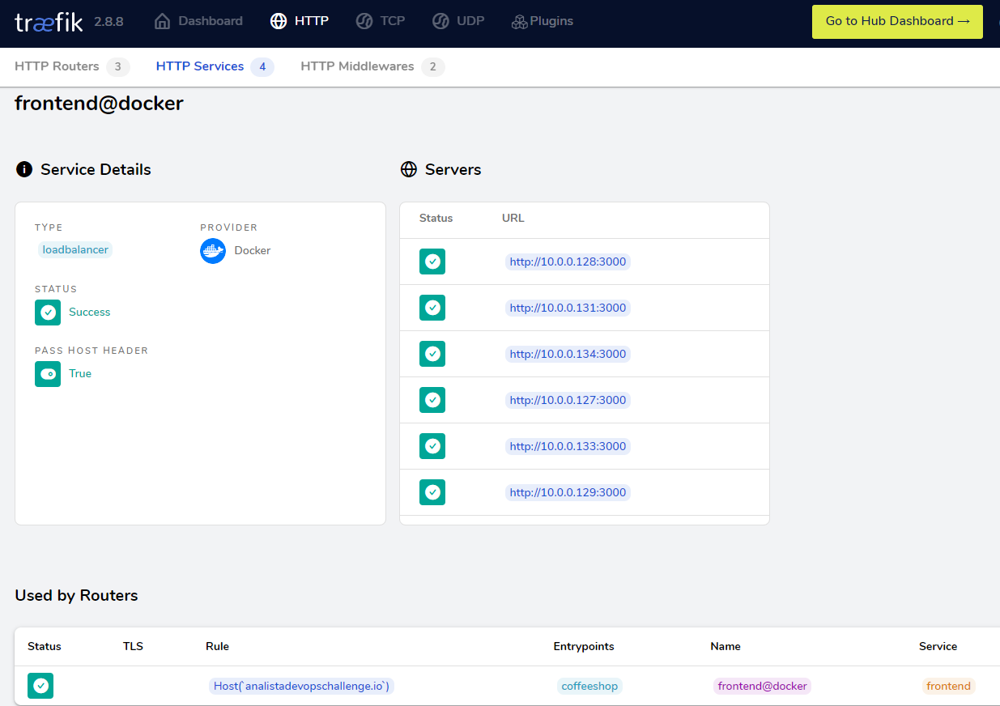

  # Escopo do Desafio
  ## Etapa 1: Automação com IaC (Infrastructure As Code)
  Demonstre sua expertise em ferramentas de automação, preferencialmente com Ansible (ou qualquer outra ferramenta de IaC que preferir). Sua tarefa é:

  #### 1. Instalar e configurar um cluster Kubernetes com k3s OU um cluster Docker Swarm em 3 máquinas:
    - Máquina master-1: Nó master.
    - Máquina worker-2: Nó worker.
    - Máquina worker-3: Nó worker.

  ## Procedimentos de implementação do que foi pedido:
  #### 1. Acessei as vms disponíveis através de uma conexão ssh com usuário e chave pública fornecida para checar qual era o Sistema Operacional:
  ```
  ssh -i <PUBLIC KEY> <USUARIO>@<IP> 'cat /etc/os-release'
  ```
  Output:
  ```text
  PRETTY_NAME="Debian GNU/Linux 12 (bookworm)"
  NAME="Debian GNU/Linux"
  VERSION_ID="12"
  VERSION="12 (bookworm)"
  VERSION_CODENAME=bookworm
  ID=debian
  HOME_URL="https://www.debian.org/"
  SUPPORT_URL="https://www.debian.org/support"
  BUG_REPORT_URL="https://bugs.debian.org/"
  ```

  #### 2. Instalei o Ansible 2.10.8 em meu ambiente local WSL 2 Ubuntu 22.04 através do comando:
  ```bash
  apt install -y ansible
  ```
  Obtive a versão mais recente disponível no repositório:

  ```bash
  ansible --version
  ```

  ```text
  ansible 2.10.8
    config file = None
    configured module search path = ['/root/.ansible/plugins/modules', '/usr/share/ansible/plugins/modules']
    ansible python module location = /usr/lib/python3/dist-packages/ansible
    executable location = /usr/bin/ansible
    python version = 3.10.12 (main, Nov 20 2023, 15:14:05) [GCC 11.4.0]
  ```

  #### 3. Configurei o ambiente Ansible com a seguinte estrutura de diretórios:
  ```text
  ansible
      ├── group_vars
      │   └── all
      ├── hosts
      ├── main.yaml
      ├── roles
      │   ├── docker
      │   │   └── tasks
      │   │       └── main.yaml
      │   ├── manager
      │   │   └── tasks
      │   │       └── main.yaml
      │   └── worker
      │       └── tasks
      │           └── main.yaml
      └── ssh.key
  ```
  ##### 3.1 Entendendo a configuração do Ansible:
  >[!IMPORTANT]
  >
  >Os parâmetros **\<IP ADDRESS\>** e **\<PATH\>/\<PUBLIC KEY\>** foram substituídos pelos dados fornecidos.


  **Arquivo hosts**
  Inventário de hosts que o playbook Ansible irá aplicar as configurações:
  ```text
  [docker_swarm_manager]
  manager1 ansible_host=<IP ADDRESS>

  [docker_swarm_worker]
  worker1 ansible_host=<IP ADDRESS>
  worker2 ansible_host=<IP ADDRESS>

  [all:vars]
  ansible_ssh_user=<USER>
  ansible_become=true
  ansible_ssh_private_key_file=<PATH>/<PUBLIC KEY>
  ansible_python_interpreter=/usr/bin/python3
  ```

  **Arquivo main.yaml**
  O playbook do projeto. O arquivo principal contendo os passos que deverão ser aplicados nos hosts:
  ```yaml
  ---
  - name: Docker Swarm Manager Configuration
    hosts: docker_swarm_manager

    roles:
      - docker
      - manager

  - name: Docker Swarm Workes Configuration
    hosts: docker_swarm_worker
    roles:
      - docker
      - worker
  ...
  ```

  Este arquivo está estruturado em passos macros que aplicam as configurações definidas em cada grupo de hosts presentes no inventário:

  - **Docker Swarm Manager Configuration**: passo macro aplicado nos hosts do grupo **docker_swarm_manager**. Ele aplica as roles (papéis que contém tarefas que de fato aplicam a configuração definida nelas) de instalação e configuração do Docker e ativação do modo Swarm e geração de um token para ingressar workers no Cluster. Além disso, adiciona o usuário ao grupo docker.

  - **Docker Swarm Workes Configuration**: passo macro aplicado nos hosts do grupo **docker_swarm_worker**. Ele aplica as roles de instalação e configuração do Docker e obtenção do token gerado pelo manager e ingresso dos workers no Cluster. Além disso, adiciona o usuário ao grupo docker.

  #### 4. Executei o playbook Ansible para provisionamento do Cluster Docker Swarm:
  ```
  ansible-playbook -i hosts main.yaml
  ```

  #### 5. Validação da instalação
  Após execução com sucesso do playbook Ansible, validei os passos descritos nele para os três hosts.

  - Verificando a saída do comando `docker info` **nos três hosts**: 
  ```bash
  ssh -i challenge.pem <USER>@<IP ADDRESS> 'docker info'
  ```
  ```bash
  Client: Docker Engine - Community
  Version:    25.0.3
  Context:    default
  Debug Mode: false
  Plugins:
    buildx: Docker Buildx (Docker Inc.)
      Version:  v0.12.1
      Path:     /usr/libexec/docker/cli-plugins/docker-buildx
    compose: Docker Compose (Docker Inc.)
      Version:  v2.24.5
      Path:     /usr/libexec/docker/cli-plugins/docker-compose

  Server:
  Containers: 10
    Running: 9
    Paused: 0
    Stopped: 1
  Images: 9
  Server Version: 25.0.3
  Storage Driver: overlay2
    Backing Filesystem: extfs
    Supports d_type: true
    Using metacopy: false
    Native Overlay Diff: true
    userxattr: false
  Logging Driver: json-file
  Cgroup Driver: systemd
  Cgroup Version: 2
  Plugins:
    Volume: local
    Network: bridge host ipvlan macvlan null overlay
    Log: awslogs fluentd gcplogs gelf journald json-file local splunk syslog
  Swarm: active
    NodeID: riw578c386qjsaua6621pqb6b
    Is Manager: true
    ClusterID: sc1j5kzsz1wgbe9lilmo2dh0x
    Managers: 1
    Nodes: 3
    Default Address Pool: 10.0.0.0/8
    SubnetSize: 24
    Data Path Port: 4789
    Orchestration:
    Task History Retention Limit: 5
    Raft:
    Snapshot Interval: 10000
    Number of Old Snapshots to Retain: 0
    Heartbeat Tick: 1
    Election Tick: 10
    Dispatcher:
    Heartbeat Period: 5 seconds
    CA Configuration:
    Expiry Duration: 3 months
    Force Rotate: 0
    Autolock Managers: false
    Root Rotation In Progress: false
    Node Address: <IP ADDRESS>
    Manager Addresses:
    <IP ADDRESS>:2377
  Runtimes: io.containerd.runc.v2 runc
  Default Runtime: runc
  Init Binary: docker-init
  containerd version: ae07eda36dd25f8a1b98dfbf587313b99c0190bb
  runc version: v1.1.12-0-g51d5e94
  init version: de40ad0
  Security Options:
    apparmor
    seccomp
    Profile: builtin
    cgroupns
  Kernel Version: 6.1.0-18-cloud-amd64
  Operating System: Debian GNU/Linux 12 (bookworm)
  OSType: linux
  Architecture: x86_64
  CPUs: 1
  Total Memory: 1.637GiB
  Name: <FQDN>
  ID: 6d8f4f12-fe54-4e11-b82f-fb6272859141
  Docker Root Dir: /var/lib/docker
  Debug Mode: false
  Experimental: true
  Insecure Registries:
    127.0.0.0/8
  Live Restore Enabled: false
  ```
  Uma alternativa para retornar a saída mais reduzida e apenas com a informação sobre o modo Swarm:
  ```bash
  ssh -i <PUBLIC KEY> <USER>@<IP ADDRESS> 'docker info | grep -wE "Swarm|Is Manager"'
  ```
  Saída para o manager:
  ```text
  Swarm: active
    Is Manager: true
  ```
  Saída para os workers
  ```text
  Swarm: active
    Is Manager: false
  ```

  ### Etapa 2: Pipeline de Deploy
  Implemente uma pipeline no GitlabCI ou Github Actions para o deploy da aplicação Coffee Shop no cluster configurado na etapa anterior. Código-fonte disponível em: https://gitlab.com/o_sgoncalves/coffee-shop.

  Para a pipeline foi criado o arquivo .git/workflows/coffee-shop_workflos.yaml no repositório da aplicação coffee-shop, que consiste nos seguintes passos:

  - Login do Docker Hub
  - Build e Push da imagem da aplicação coffee-shop para o Docker Hub
  - Confiugarações ssh para conexão com o Manager do Cluster Swarm
  - Deploy da aplicação no Cluster Swarm via ssh

  >[!NOTE]
  > 
  > ESTE WORKFLOW ESTÁ HABILITADO PARA DISPARAR DE FORMA MANUAL APENAS. CABEM MUITAS MELHORIAS RELACIONADAS AO FLUXO DE CI/CD E EVENTOS QUE PODERIAM DISPARAR A PIPELINE.


  >[!IMPORTANT]
  >
  > PARA CONEXÃO SSH COM A MÁQUINA VIRTUAL DO NODE MANAGER FOI NECESSÁRIO A CRIAÇÃO DE UM PAR DE CHAVES SSH `ssh-keygen -t rsa -b 4096 -C "email@email"`. ESTE PAR DE CHAVES FOI INSERIDO COMO SECRET NAS CONFIGURAÇÕES DO REPOSITÓRIO EM **Settings - Secrets and variables - Actions - New repository secret**
  


  Este workflow utiliza das seguintes variáveis de ambiente para a execução dos jobs:

  - **DOCKERHUB_TOKEN**: Token de autenticação PAT do Docker Hub para push da imagem durante o step de build. 
  >[!NOTE]
  >
  > Para gerar um token de autenticação no Docker Hub:
  > - Faça login no Docker Hub.
  > - Selecione seu avatar no canto superior direito e no menu suspenso selecione >Minha conta.
  > - Selecione a guia Segurança e depois Novo Token de Acesso.
  > - Adicione uma descrição para o seu token. Use algo que indique o caso de uso ou finalidade do token.
  >
  > - Defina as permissões de acesso. As permissões de acesso são escopos que definem restrições em seus repositórios. Por exemplo, para permissões de leitura e gravação, um pipeline de automação pode criar uma imagem e enviá-la para um repositório. No entanto, não é possível excluir o repositório.
  >
  > - Selecione Gerar e copie o token que aparece na tela e salve-o. Você não poderá recuperar o token depois de fechar este prompt.

  - **DOCKER_SSH_PRIVATE_KEY**: chave ssh privada gerada no manager. Utilizada pelo github durante a execução do workflow para autenticação na máquina virtual.
  - **DOCKER_SSH_PUBLIC_KEY**: chave ssh publica gerada no manager. Utilizada pelo github durante a execução do workflow para autenticação na máquina virtual.
  - **DOCKER_USERNAME**: usuario de autenticação no Docker Hub. Utilizando em conjunto com o PAT(Personal Access Token).
  - **HOST**: Endereço IP do manager.
  - **SSH_USER**: usuário de autenticação via ssh no manager.

```yaml
---
name: Coffee Shop Deploy

on:
  #push:
  #  branches:
  #    - jorge
  workflow_dispatch:

jobs:
  build:
    runs-on: ubuntu-latest
    steps:
      - name: Checkout
        uses: actions/checkout@v4
      
      - name: Login to Docker Hub
        uses: docker/login-action@v3
        with:
          username: ${{ secrets.DOCKER_USERNAME }}
          password: ${{ secrets.DOCKERHUB_TOKEN }}
      - name: Set up Docker Buildx
        uses: docker/setup-buildx-action@v3
      
      - name: Build and push
        uses: docker/build-push-action@v5
        with:
          context: .
          push: true
          tags: ${{ secrets.DOCKER_USERNAME }}/${{ github.event.repository.name }}:latest
  
  deploy:
    runs-on: ubuntu-latest
    needs: build
    steps:
      - name: Checkout stack
        uses: actions/checkout@v4
        with:
          sparse-checkout: |
            docker-stacks/coffee-shop-stack.yaml
          sparse-checkout-cone-mode: false
      
      - name: Install SSH Key
        uses: shimataro/ssh-key-action@v2
        with:
          key: ${{ secrets.DOCKER_SSH_PRIVATE_KEY }}    
          known_hosts: 'just-a-placeholder-so-we-dont-get-errors'

      - name: Adding Known Hosts
        run: ssh-keyscan -H ${{ secrets.HOST }} >> ~/.ssh/known_hosts

      - name: Coffe-Shop Stack SSH Transfer to Cluster Swarm
        run: scp docker-stacks/coffee-shop-stack.yaml ${{ secrets.SSH_USER }}@${{ secrets.HOST }}:/home/suporte/stacks/
      
      - name: Coffe-Shop Stack Deploy
        run: ssh ${{ secrets.SSH_USER }}@${{ secrets.HOST }} 'docker stack deploy -c stacks/coffee-shop-stack.yaml coffee-shop'
...
```

### Etapa 3: Monitoramento do Sistema
Configure um sistema de monitoramento (sugerimos prometheus + grafana) para o cluster e a aplicação Coffee Shop
  .
>[!NOTE]
> 
> OS PASSOS ABAIXO FORAM EXECUTADOS NO HOST master-01 via pipeline do Github Actions

#### Instalação do Portainer
>[!NOTE]
>
> MELHORIA NO GERENCIAMENTO DO CLUSTER

Instalação e configuração do Portainer para facilitar o gerenciamento do Cluster:
#### Github Actions Workflow: Portainer Stack Deploy
```yaml
---
name: Portainer Stack Deploy

on:
  #push:
  #  branches:
  #    - jorge
  workflow_dispatch:

jobs:
  deploy:
    runs-on: ubuntu-latest
    steps:
      - name: Checkout stack
        uses: actions/checkout@v4
        with:
          sparse-checkout: |
            docker-stacks/portainer-stack.yaml
          sparse-checkout-cone-mode: false
      
      - name: Install SSH Key
        uses: shimataro/ssh-key-action@v2
        with:
          key: ${{ secrets.DOCKER_SSH_PRIVATE_KEY }}    
          known_hosts: 'just-a-placeholder-so-we-dont-get-errors'

      - name: Adding Known Hosts
        run: ssh-keyscan -H ${{ secrets.HOST }} >> ~/.ssh/known_hosts

      - name: Coffe-Shop Stack SSH Transfer to Cluster Swarm
        run: scp docker-stacks/portainer-stack.yaml ${{ secrets.SSH_USER }}@${{ secrets.HOST }}:/home/suporte/stacks/
      
      - name: Coffe-Shop Stack Deploy
        run: ssh ${{ secrets.SSH_USER }}@${{ secrets.HOST }} 'docker stack deploy -c stacks/portainer-stack.yaml portainer'
...
```
O Portainer esta disponível em http://\<IP ADDRESS\>:9000


#### Instalação da Stack de Monitoramento
Habilitar a exposição de métricas do docker no arquivo **/etc/docker/daemon.json** em todos os hosts do cluster. Esta edição foi feita manualmente:
```json
  {
    "metrics-addr" : "127.0.0.1:9323",
    "experimental" : true
  }
```
É necessário reiniciar o docker para aplicar as configurações:
```bash
systemctl restart docker
```

#### Instalação e configuração do Prometheus
O arquivo de configuração do Prometheus foi criado em **/home/<USER>/stacks/prometheus.yml**. Este arquivo será montado posteriomente pelo container do Prometheus durante o deploy da stack de monitoramento. Seu conteúdo é o seguinte:

```yaml
global:
  scrape_interval: 15s 
  #evaluation_interval: 15s
  scrape_timeout: 15s
  external_labels:
    monitor: "codelab-monitor"

rule_files:

scrape_configs:
  - job_name: prometheus
    static_configs:
      - targets: ["localhost:9090"]

  - job_name: docker
    static_configs:
      - targets: ["host.docker.internal:9323"]

  - job_name: swarm
    dockerswarm_sd_configs:
      - host: unix:///var/run/docker.sock
        role: nodes
    relabel_configs:
      # Fetch metrics on port 9323.
      - source_labels: [__meta_dockerswarm_node_address]
        target_label: __address__
        replacement: $1:9323
      # Set hostname as instance label
      - source_labels: [__meta_dockerswarm_node_hostname]
        target_label: instance

  # Create a job for Docker Swarm containers.
  - job_name: containers
    dockerswarm_sd_configs:
      - host: unix:///var/run/docker.sock
        role: tasks
    relabel_configs:
      # Only keep containers that should be running.
      - source_labels: [__meta_dockerswarm_task_desired_state]
        regex: running
        action: keep
      # Only keep containers that have a `prometheus-job` label.
      - source_labels: [__meta_dockerswarm_service_label_prometheus_job]
        regex: .+
        action: keep
      # Use the prometheus-job Swarm label as Prometheus job label.
      - source_labels: [__meta_dockerswarm_service_label_prometheus_job]
        target_label: job

  - job_name: coffee-shop
    scrape_interval: 30s
    scrape_timeout: 15s
    static_configs:
      - targets: ["host.docker.internal:3000"]

  - job_name: cadvisor
    scrape_interval: 60s
    scrape_timeout: 60s
    static_configs:
      - targets: ["host.docker.internal:8080"]
```

Ele contém as seguintes configurações:

 - **job_name: prometheus**: auto-monitoramento do Prometheus.
 - **job_name: docker**: monitoramento do docker daemon.
 - **job_name: swarm**: monitoramento dos recursos do Docker Swarm.
 - **job_name: containers**: monitoramento dos containers.
 - **job_name: coffee-shop**: monitoramento da aplicação coffee-shop.
 - **job_name: cadvisor**: monitoramento do containr do cadvisor.

Criação do arquivo da stack de monitoramento **monitoring-stack.yaml**:
```yaml
---
version: '3.7'

volumes:
    prometheus_data: {}
    grafana_data: {}

networks:
  monitor-net:

services:

  prometheus:
    image: prom/prometheus:v2.36.2
    volumes:
      - /etc/prometheus/prometheus.yml:/etc/prometheus/prometheus.yml
      - prometheus_data:/prometheus
      - /var/run/docker.sock:/var/run/docker.sock:ro
    command:
      - '--config.file=/etc/prometheus/prometheus.yml'
      - '--storage.tsdb.path=/prometheus'
      - '--web.console.libraries=/usr/share/prometheus/console_libraries'
      - '--web.console.templates=/usr/share/prometheus/consoles'
      - '--web.enable-lifecycle'
      - '--web.enable-admin-api'
    ports:
      - 9090:9090
    depends_on:
      - cadvisor
    networks:
      - monitor-net
    extra_hosts:
      - "host.docker.internal:host-gateway"
    deploy:
      placement:
        constraints:
          - node.role==manager
      restart_policy:
        condition: on-failure

  node-exporter:
    image: quay.io/prometheus/node-exporter:latest
    volumes:
      - /proc:/host/proc:ro
      - /sys:/host/sys:ro
      - /:/rootfs:ro
    command:
      - '--path.procfs=/host/proc'
      - '--path.sysfs=/host/sys'
      - --collector.filesystem.ignored-mount-points
      - "^/(sys|proc|dev|host|etc|rootfs/var/lib/docker/containers|rootfs/var/lib/docker/overlay2|rootfs/run/docker/netns|rootfs/var/lib/docker/aufs)($$|/)"
    ports:
      - 9100:9100
    networks:
      - monitor-net
    deploy:
      mode: global
      restart_policy:
          condition: on-failure

  cadvisor:
    image: gcr.io/cadvisor/cadvisor
    volumes:
      - /:/rootfs:ro
      - /var/run:/var/run:rw
      - /sys:/sys:ro
      - /var/lib/docker/:/var/lib/docker:ro
    ports:
      - 8080:8080
    networks:
      - monitor-net
    deploy:
      mode: global
      restart_policy:
          condition: on-failure

  grafana:
    image: grafana/grafana
    depends_on:
      - prometheus
    ports:
      - 3001:3000
    volumes:
      - grafana_data:/var/lib/grafana
    networks:
      - monitor-net
    user: "472"
    deploy:
      placement:
        constraints:
          - node.role==manager
      restart_policy:
        condition: on-failure
... 
```

### Aplicação da stack de monitoramento no Cluster
A stack de monitoramento foi aplicada via pipeline do Github Actions. O workflow está definido no arquivo **.github/workflows/monitoring-stack_workflow.yaml**. No Github, em **Actions - Coffee Shop Deploy - Run workflow - Run workflow**:


Verificando o status da stack:
Após a execução do workflow com sucesso, para validar a aplicação da stack basta logar no host executar o comando abaixo:
```bash
docker stack ps monitoring
```


Validando a coleta de métricas no Painel do Prometheus:
O painel do Prometheus está disponível em **http://\<IP ADDRESS\>:9090**:


  Validando os Dashboard do Grafana:
  O painel do Grafana está disponível em **http://\<IP ADDRESS\>:3001**:
  
  

### Avaliação do desafio
>[!NOTA]
> O teste proposto foi de fato um desafio técnico para mim. A quase 3 anos que não tinha contato com tecnologias como o Ansible e Docker Swarm, porque em meu dia a dia de trabalho atuava com outras tecnologias. Eu precisei consultar minhas documentações de estudo para refrescar a memória. 
>
> Em relação ao Prometheus, não sabia praticamente nada antes do Desafio e particularmente foi gratificante sair do 0 e implementar uma stack de monitoramento baseada nessa ferramenta. Agora estou bem impolgado para estuda-la mais :). 
>
> A pipeline foi onde tive um pouco mais de difuldade durante a implementação. u já havia tido contato com o Github Actions, porém não no nível de criação de pipeline, e portanto, tive que aprender a criá-las do 0. Isso foi muito bom para mim e agora estou com bastante interesse em dissecar o Github no geral, não apenas a parte de Actions.


### Status atual do ambiente:
- [x] Etapa 1: Automação com IaC (Infrastructure As Code)
- [x] Etapa 2: Pipeline de Deploy 
- [x] Etapa 3: Monitoramento do Sistema
- [x] Implementação Extra do Traefik como proxy

### Recomendação futura:
- [x] Definição de um fluxo de CI/CD para ambientes de dev,hom e prod.
- [x] Otmização do processo de build para que seja o mais efetivo e menos demorado possível.
- [x] Implementação de proxy reverso com Traefik para controle de acesso centralizado através de subdomínios em todos os recursos implementados no Cluster Swarm.
- [x] Implementação de logs.
- [x] Implementação de tracing.


>[!NOTE]
> 
> Eu iniciei a implementação do Traefik, porém não soube faze-lo funcionar da maneira adequada para a configuração do proxy reverso para aplicação Coffee Shop. Este é um ponto de melhoria que requer mais estudos da minha parte.
O Traefik está disponível na endereço http://\<IP ADDRESS\>:8081:




<!---
  Essa abordagem está funcionando:
  ```bash
  docker run -d --name prometheus \
      --mount type=bind,source=/etc/prometheus/prometheus.yaml,destination=/etc/prometheus/prometheus.yml \
      --mount type=bind,src=/var/run/docker.sock,dst=/var/run/docker.sock,ro \
      -p 9090:9090 \
      --add-host host.docker.internal=host-gateway \
      prom/prometheus
  ```
  grafana:3000
  cadvisor:8080
  node-exporter:9191
  prometheus:9090
  ### Monitoramento dos containers
  ```bash
  docker service create --name cadvisor -l prometheus-job=cadvisor \
      --mode=global --publish target=8080,mode=host \
      --mount type=bind,src=/var/run/docker.sock,dst=/var/run/docker.sock,ro \
      --mount type=bind,src=/,dst=/rootfs,ro \
      --mount type=bind,src=/var/run,dst=/var/run \
      --mount type=bind,src=/sys,dst=/sys,ro \
      --mount type=bind,src=/var/lib/docker,dst=/var/lib/docker,ro \
      gcr.io/cadvisor/cadvisor -docker_only
  ```

  ### Monitoramento da aplicação coffe-shop
  O monitoramento da aplicação coffe-shop se dá através da adição do job no /etc/prometheus/prometheus.yaml:
  ```yaml
    - job_name: coffee-shop
      scrape_interval: 60s
      scrape_timeout: 60s
      static_configs:
        - targets: ["host.docker.internal:3000"]
  ```

  ### Implementando o Grafana
  docker volume create grafana-storage

  docker run -d -p 3001:3000 --name=grafana \
    --volume grafana-storage:/var/lib/grafana \
    --add-host host.docker.internal=host-gateway \
    grafana/grafana-enterprise
-->
